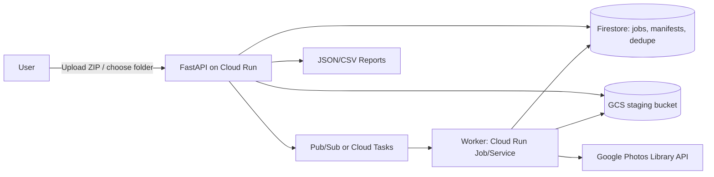

# snap-export-to-google-photos-gcp

Personal-use, resumable importer for moving **Snapchat My Data export media** into **Google Photos** using official APIs only.

## Why this repository does not pull directly from Snapchat

This project intentionally **does not** use unofficial Snapchat APIs, browser automation, credential scraping, reverse-engineered endpoints, or login automation. It only accepts user-provided exports (ZIP/folder) and uploads to Google Photos through the official OAuth 2.0 + Google Photos Library API flow.

## Architecture



## Features

- ZIP upload and folder-based imports.
- Safe ZIP extraction (zip-slip protection).
- Recursive media discovery with supported-type filtering.
- Timestamp inference fallback: export metadata → media metadata (extensible) → file mtime.
- SHA-256 + size + timestamp dedupe key.
- Resumable job states with pause/resume/cancel.
- Google Photos two-step upload (bytes then create media item).
- Album organization strategies: `year`, `year_month` (default), `single_import`.
- JSON + CSV job reports.

## Repository layout

- `app/api/` API endpoints
- `app/core/` service wiring
- `app/config/` pydantic settings
- `app/domain/` enums and interfaces
- `app/services/` orchestration logic
- `app/adapters/google_photos/` Google Photos client
- `app/adapters/storage/` storage adapters
- `app/adapters/db/` repository adapters
- `app/workers/` async worker entrypoint
- `app/models/` typed models
- `app/utils/` utility functions
- `infra/terraform/` infrastructure IaC
- `docs/` design/security docs

## Quickstart

```bash
make setup
cp .env.example .env
make run
```

### OAuth setup (Google)

1. Create OAuth Client ID in Google Cloud Console.
2. Enable Google Photos Library API.
3. Configure redirect URI (`/auth/google/callback`).
4. Store client secret in Secret Manager.
5. Set secret references in environment variables.

## API examples (curl)

```bash
# OAuth start
curl -X POST http://localhost:8080/auth/google/start

# OAuth callback
curl "http://localhost:8080/auth/google/callback?code=CODE&state=STATE"

# Create import from local folder
curl -X POST "http://localhost:8080/imports?local_folder_path=/tmp/snap-export"

# Create import from ZIP upload
curl -X POST -F "upload=@./my-data.zip" http://localhost:8080/imports

# List imports
curl http://localhost:8080/imports

# Get import
curl http://localhost:8080/imports/<job_id>

# Start upload
curl -X POST http://localhost:8080/imports/<job_id>/start

# Pause
curl -X POST http://localhost:8080/imports/<job_id>/pause

# Resume
curl -X POST http://localhost:8080/imports/<job_id>/resume

# Cancel
curl -X POST http://localhost:8080/imports/<job_id>/cancel

# Report JSON
curl http://localhost:8080/imports/<job_id>/report

# Report CSV
curl "http://localhost:8080/imports/<job_id>/report?fmt=csv"

# Health checks
curl http://localhost:8080/healthz
curl http://localhost:8080/readyz
```

## Deployment (GCP)

1. `terraform -chdir=infra/terraform init && terraform -chdir=infra/terraform apply`
2. Build and push container image.
3. Deploy API service to Cloud Run.
4. Deploy worker as Cloud Run Job/service.
5. Configure Pub/Sub or Cloud Tasks target for async processing.

Rollback-safe notes are in `docs/architecture.md`.

## Troubleshooting

- `invalid oauth state`: restart auth flow and ensure callback state matches.
- `unsupported_extension`: file is recorded in report but not uploaded.
- Partial completion: rerun `/resume`; dedupe prevents re-upload of completed files.
